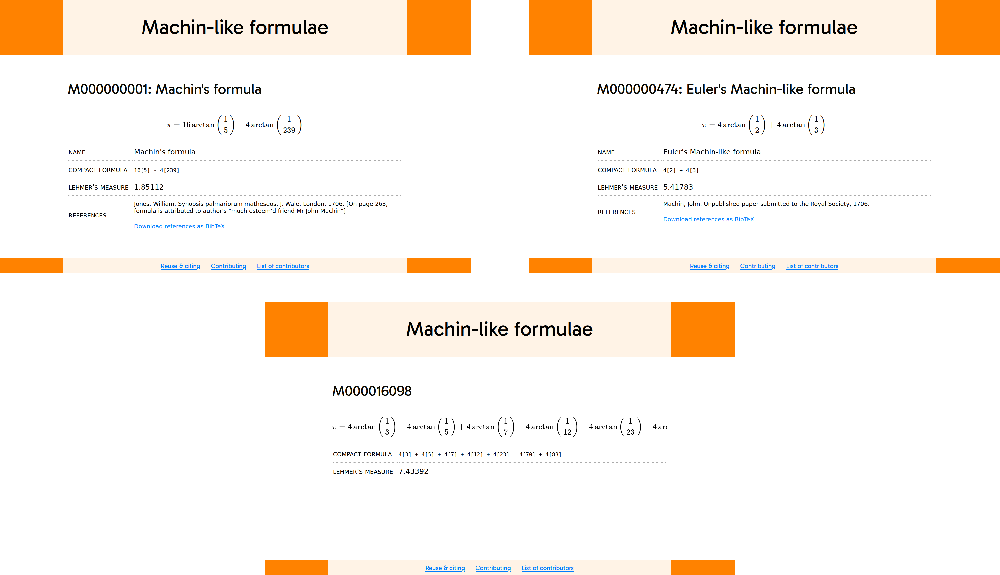

# Summary

In 1706, William Jones published the following formula for $\uppi$\footnote{The formula published by Jones was actually a formula for $\uppi/4$ equivalent to the one we include here. We have decided to adopt the convention of always writing Machin-like formulae as equal to $\uppi$ rather than using fractions of $\uppi$.},
which he attributed to his "much esteem'd friend Mr John Machin" [@jones1706]:

$$\uppi=16\arctan\left(\frac{1}{5}\right)-4\arctan\left(\frac{1}{239}\right).$$

This formula has since become known as Machin's formula and other formulae expressing $\uppi$ as a sum of arctangents
have become known as Machin-like formulae. It is believed [@tweddle1991] that John Machin submitted a paper [@machin-unpublished] containing
Machin's formula and four other Machin-like formulae to the Royal Society in 1706. No surviving copy of this unpublished paper is known to exist, but
the formulae included in it were later rediscovered and published by @hermann1706, @euler1744 and @hutton1776.
Further Machin-like formulae were discovered in the following 300 years by
@stormer1896, @wrench1938, @lehmer1938, @takano1983 and @wetherfield1996, among others.

In @todd1949, a method for generating new Machin-like formulae was proposed: by writing $\arctan(1/x)$ as $\arg(x+\mathrm{i})$ and noting that
$a\arg(z) + b\arg(w)\equiv\arg(z^aw^b)$, the task of finding new Machin-like formulae could be rewrittten as factorising Gaussian integers.
For example, the factorisation $5+5\mathrm{i}=(2+\mathrm{i})(3+\mathrm{i})$ tells us that $\arctan(1)=\arctan(1/2)+\arctan(1/3)$,
which is equivalent to the following Machin-like formula, which appeared in @machin-unpublished and @euler1744 and is often called Euler's Machin-like formula:
$$\uppi=4\arctan\left(\frac12\right)+4\arctan\left(\frac13\right).$$

Starting in 1991, Michael Wetherfield worked on a piece of software called Machination that uses the method from @todd1949 to generate
Machin-like formulae. The software was written in C and machine code, and its functionality is described in @wetherfield1996 and @machination-software.
Formulae generated by this software were included, alongside a large amount of other information about Machin-like formulae, on the Machination website
[@old-website]. This website is no longer live and only available via the Internet Archive's Wayback Machine, and it appears that the Machination software
is not available anywhere online.

Inspired by this past work, we have created the `arctans` Python package, available under the MIT open source license. This package includes functionality to symbolically express and manipulate sums of arctangents
and functions that generate arctangent sum formulae equivalent formulae that are passed an an input: if a list Machin-like formulae are input, this would then generate
more Machin-like formulae, but the package could also be used to generate arctangent sum formulae equal to values of interest other than $\uppi$.

Using a list of Machin-like formulae that we compiled from the literature and the Machination website [@old-website]---alongside some new formulae
generated using `arctans`---we have created the website \href{https://machin-like.org}{machin-like.org} [@machin-like.org].
The website is hosted using GitHub pages, with a page for each formula generated from a plain text formula file.
Screenshots of the pages on \href{https://machin-like.org}{machin-like.org} for Machin's formula, Euler's Machin-like formula and
a randomly selected Machin-like formula are shown in \autoref{fig:machin-like}.
The code used to generate the website is available under an MIT license, and utilises tools originally written to generate the DefElement finite element encyclopedia [@2025-defelement].

{ width=95% }

# Statement of need
While it may have had much of the same functionality as `arctans`, the fact that the Machination software is no longer available and
appears to not have been licensed under an open source license makes the need for new library clear. Additionally, Machination was
written to run on Windows 98 and issues with it running on Windows ME are documented [@machination-software]. It therefore seems
unlikely that this software would run on a modern computer even if a copy of it were obtained.

We are not aware of any other Python package that is designed to manipulate formulae involving arctangents.

# References
